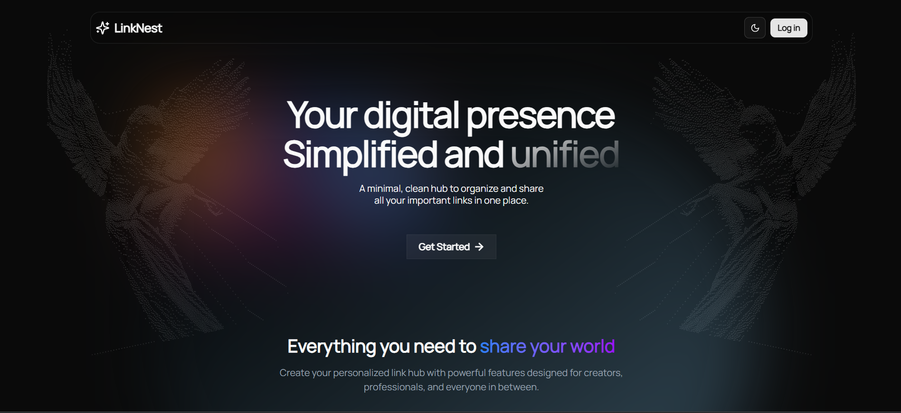
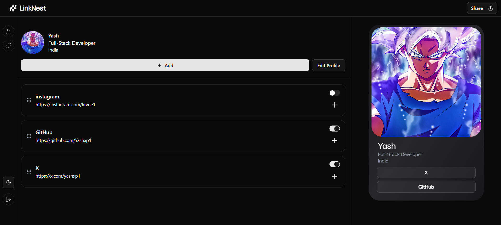

# LinkNest 🧩

A fully-featured, customizable Linktree clone built with **Next.js 14**, **Tailwind CSS**, **Prisma**, and **NextAuth**. Manage your bio, social links, and showcase multiple URLs from a single profile page — all in real time.

---

## ✨ Features

- 🔐 Authentication (NextAuth.js)
- 📎 Editable profile (bio, location, slug)
- 🔗 Add/Edit/Delete links
- 👀 Link visibility toggles
- 🌙 Responsive & clean UI (Tailwind)
- 💽 PostgreSQL + Prisma ORM
- 🚀 Deployed on Vercel

---

## 📸 Demo

[Live site](https://linknest1.vercel.app)

---

## 🧠 Tech Stack

- **Frontend:** Next.js App Router, Tailwind CSS, TypeScript
- **State Management:** Zustand
- **Backend:** Next.js API routes
- **Database:** PostgreSQL + Prisma
- **Auth:** NextAuth.js (Google/GitHub/email)
- **Deployment:** Vercel

---

## 📦 Installation

```bash
git clone https://github.com/yourusername/linknest.git
cd linknest
npm install
npx prisma generate
npx prisma migrate dev
npm run dev
